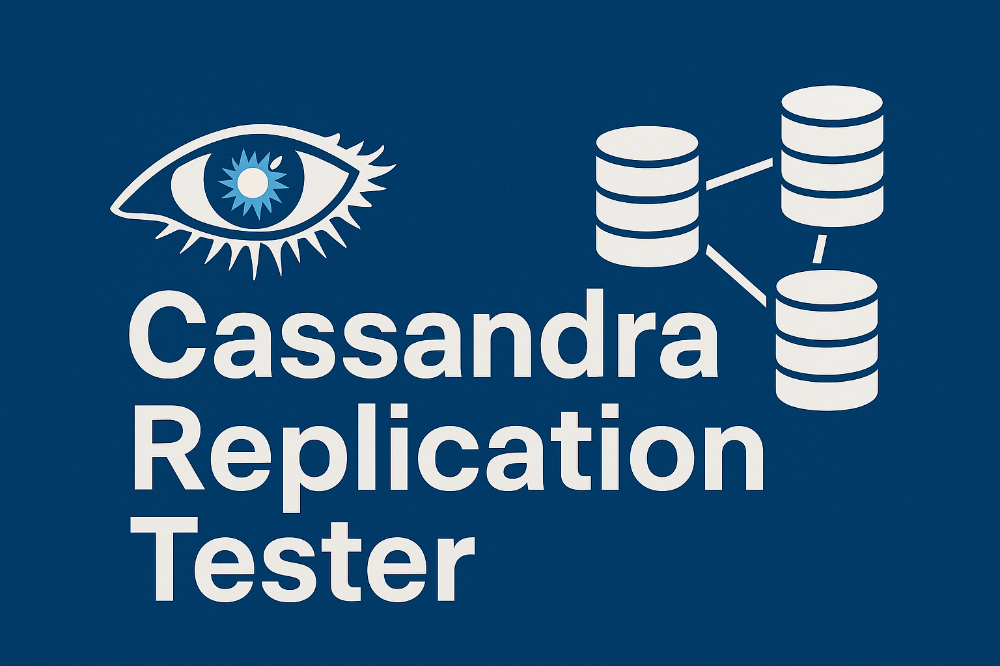

<p align="center"></p>

# Cassandra Test Cluster (Podman)

This README walks you through spinning up a **full-fledges Apache Cassandra 5.0.4 cluster** with **Podman** (or Docker), creating an **isolated Python virtual‑environment**, and running two flavours of **replication‑sanity tests**:

* **SQL‑style** – fixed‑schema table.
* **NoSQL‑style** – document stored in a `MAP<text,text>` column.

Both scripts write through **node A** (`localhost:9042`), read through the others.

## Directory layout

```text
project‑root/
├─ compose.yaml                     # two‑node cluster definition
├─ replication_tests.py             # test script
├─ requirements.txt                 # Python deps (just cassandra‑driver)
└─ README.md                        # ← this file
```

## 0 · Prerequisites

| Tool           | Version tested | Install hint                                                                                       |
| -------------- | -------------- | -------------------------------------------------------------------------------------------------- |
| **Podman**     | ≥ 4.x          | [https://podman.io](https://podman.io) (`sudo dnf install podman` / `brew install podman`)         |
| **Python**     | ≥ 3.8          | Bundled on most Linux/macOS; Windows: [https://python.org/downloads](https://python.org/downloads) |
| **pip / venv** | same as Python | Comes with Python 3                                                                                |

> **Rootless vs rootful Podman** – the compose file works in **either** mode. If you stay rootless, Podman ignores any static IP directives; that’s fine for this demo.

## 1 · Spin up the cluster

### 1.1 Clone / copy the repo

```bash
git clone <your‑repo> cassandra‑demo
cd cassandra‑demo
```

### 1.2 Start the containers

```bash
podman compose up -d            # or: docker compose up -d
```

```bash
podman ps --format '{{.Names}} {{.Ports}}'
```

Expected:

```
cassandra-seed 0.0.0.0:9042->9042/tcp
cassandra-node-1 0.0.0.0:9043->9042/tcp
cassandra-node-2 0.0.0.0:9044->9042/tcp
cassandra-node-3 0.0.0.0:9045->9042/tcp
```

To assess the cluster's status, use the `nodetool` CLI utility:

```
podman exec -it cassandra-seed nodetool status
```


## 2 · Create and activate a virtual‑env

```bash
python3 -m venv .venv
source .venv/bin/activate        # Windows: .venv\Scripts\activate.bat
pip install -r requirements.txt               # installs cassandra‑driver
```

You should see `(.venv)` in the prompt.


## 3 · Run the replication tests

The replication test script will try to auto-discover the nodes using podman's CLI.

```bash
python replication_tests.py
```

Expected output:

```
[DISCOVERY] Found 4 node(s) via Podman ps json
[01] Nodes under test: localhost:9042, localhost:9043, localhost:9044, localhost:9045
[02] SQL TEST → creating sessions …
[03] SQL → INSERT id=77c106ab-070d-4a29-82b9-bac35b074295 val='8QZ2LbeGUU55' via localhost:9042
[04] ✅ SQL ok on localhost:9043
[05] ✅ SQL ok on localhost:9044
[06] ✅ SQL ok on localhost:9045
[07] NoSQL TEST → creating sessions …
[08] NoSQL → INSERT doc id=5503fb3e-ca27-4f87-9e5c-91b5908b0c1a via localhost:9042
[09] ✅ NoSQL ok on localhost:9043
[10] ✅ NoSQL ok on localhost:9044
[11] ✅ NoSQL ok on localhost:9045
[12] ALL REPLICATION TESTS PASSED 🎉
```

## 4 · Cleanup / teardown

Remove **containers, volumes, and network** in one go:

```bash
podman compose down -v          # stop + delete volumes
podman network rm cassandra_net # remove the bridge (ignored if rootless)
```

Want to keep data? Use **stop** instead:

```bash
podman compose stop             # containers halted, volumes preserved
```

Happy experimenting! 🎉
